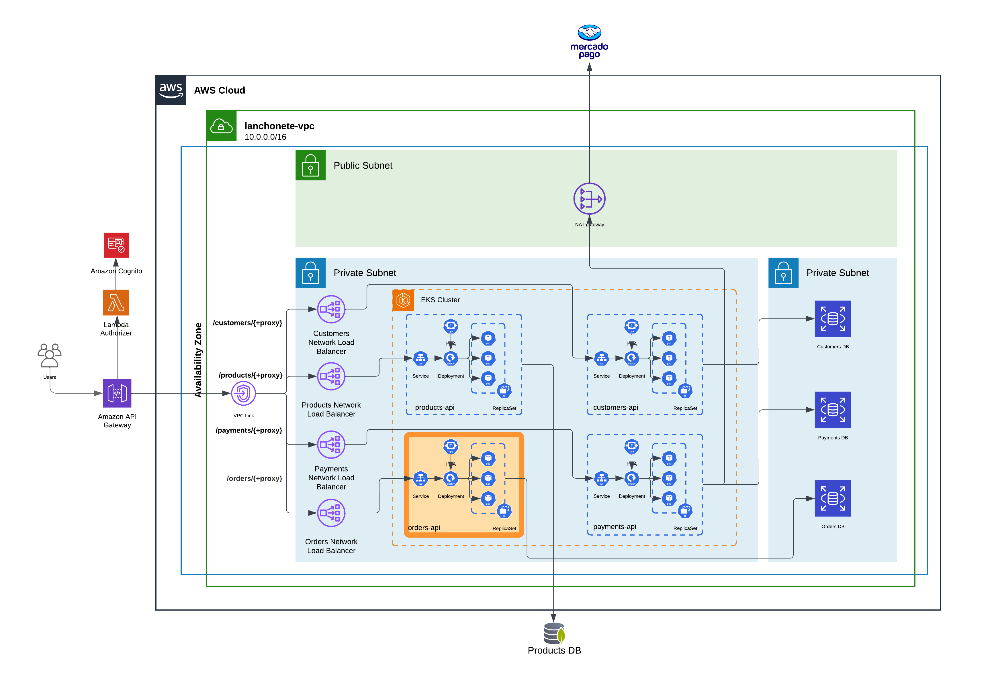

# 8SOAT FIAP Tech Challenge | Grupo 41 | Orders MS

## Como Iniciar o Projeto Localmente

Para iniciar o projeto localmente, siga os passos abaixo:

1. Certifique-se de que o Docker está instalado e em execução.
2. No diretório raiz do projeto, execute o seguinte comando:

```bash
docker-compose up
```

3. Após a execução do comando, o Swagger com a documentação de todos os endpoints estará disponível na URL:
   [http://localhost:3000/docs](http://localhost:3000/docs)

## Como Iniciar o Projeto no Kubernetes

[Guia de deploy helm + k8s](k8s/README.md)

## Arquitetura

Abaixo, está o diagrama da arquitetura do sistema, com destaque para o microserviço de orders.

